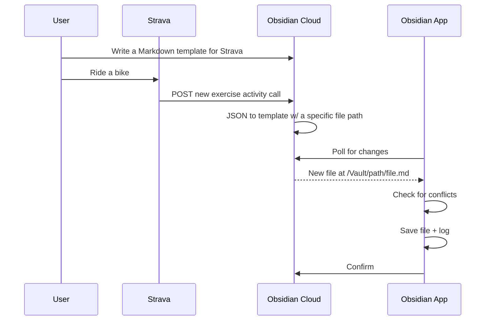

# Obsidian Cloud API

I've been thinking about an API for Obsidian for a while now, some place on the internet that could accept requests and make changes to your vault. The original idea was running Obsidian on a Linux server of some kind with a web proxy in front of it. I just did a quick search and found a Docker container for it:

https://github.com/linuxserver/docker-obsidian

That looks like fun to explore but I had a different approach come to mind. I was thinking about the whole Strava to Obsidian thing and how the PDPL approach was OK but prone to issues. A recent engineering candidate I interviewed saw that Strava has webhook capability, calling out to an endpoint when an exercise is created.

https://developers.strava.com/docs/webhooks/

That would avoid any API scraping needed to add a new activity (looks like updates are possible as well). Not all services have this capability but it would be a nice unlock. 

Handling webhooks and other automation is the JTBD here. I would love to text an item to a log or a list or append a blurb quickly to a daily note. Prepending, appending, and adding new notes are the main things I want to do, I don't need interactive editing or anything like that.

It occurred to me that you could build server that operates like the Obsidian Advanced URI plugin but in the cloud.

https://github.com/Vinzent03/obsidian-advanced-uri

Then build a simple client as an Obsidian plugin that checks for updates and maps them locally. Keep a log of changes and conflicts as a file in Obsidian. Something like:

This could also work the other way with the local app listening for changes in the file structure and pushing those to the cloud, which can then call webhooks, keep a log of some kind, etc. It looks like there are a ton of events that could trigger a call of some kind (not that you'd want an HTTP request for everything that happens). 

https://docs.obsidian.md/Reference/TypeScript+API/EventRef

I think the template would be fairly simple. You could upload a JSON sample and use the tags that are found in the Markdown template. Use Handlebars for templating.

https://github.com/handlebars-lang/handlebars.js

That's what this is!